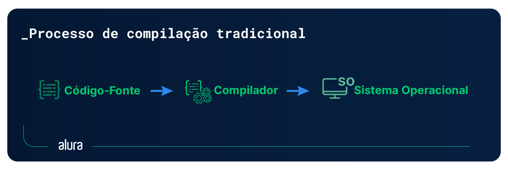
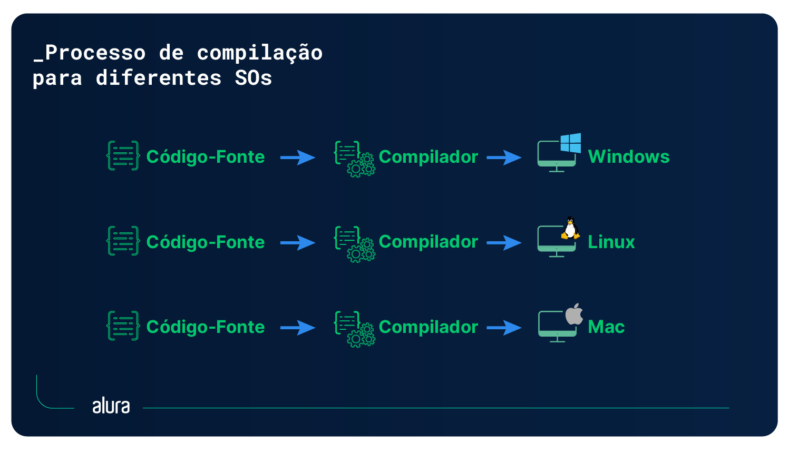
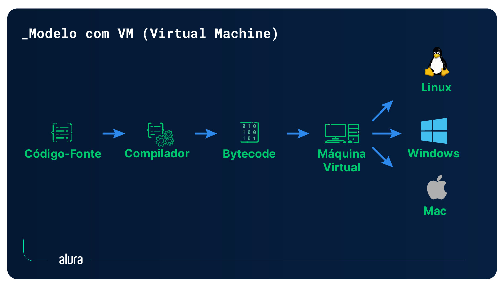
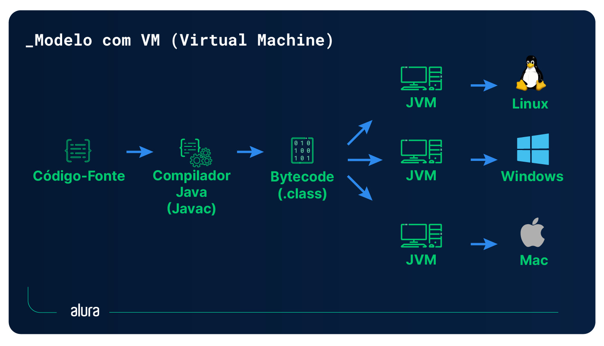

# JVM: conhecendo o processo de execução de código


## Introdução

Escrever, compilar e executar código é grande parte da rotina de pessoas que desenvolvem. Mas como será que acontece por baixo dos panos para que um programa seja executado em um sistema? Será que todas as aplicações passam pelo mesmo processo?

Neste artigo, vamos conhecer mais sobre o processo da escrita à execução de um programa, principalmente o que acontece dentro do computador para que o código escrito se torne executável, ou seja, o processo de compilação. Também vamos abordar uma alternativa ao processo tradicional de compilação, que utiliza uma máquina virtual. Por fim, vamos conhecer a Java Virtual Machine, também conhecida como JVM, que utiliza esse modelo para executar aplicações.

### Como um programa é executado?

Desde os mainframes até os dias atuais muita coisa mudou no processo de desenvolvimento, ainda que olhemos apenas para código. Na década de 1950, o compilador era uma pessoa de verdade. Isso mesmo! Uma pessoa recebia o código escrito em papel e compilava manualmente. Com o tempo, a tecnologia foi evoluindo e eventualmente foi criado o primeiro compilador como conhecemos hoje em dia.

Apesar da evolução dos compiladores, uma característica se manteve: o processo da escrita à execução do programa!



O compilador é responsável por receber o código-fonte, que é escrito por uma pessoa desenvolvedora, e traduzi-lo em código binário, gerando um arquivo executável, que é a aplicação.

Neste modelo, o compilador está intimamente ligado ao sistema operacional, pois ele precisa gerar um código binário compatível com o sistema, que é o que faz a comunicação com o processador.

Para executar o mesmo programa em diferentes sistemas, devido a essa característica, era necessário passar o código-fonte por um outro compilador específico de outro sistema operacional. E ainda assim não era garantido o funcionamento da aplicação, pois muitas bibliotecas utilizadas para o desenvolvimento do programa eram específicas de um sistema operacional e não tinham funcionalidade garantida em outros.



Então, para ter um programa com exatamente o mesmo comportamento em diferentes sistemas operacionais, era necessário adaptar o código para as bibliotecas específicas do sistema, alterar o gerenciamento de memória e passar por um compilador compatível.

Esse modelo, apesar de funcional, dificulta a vida das pessoas que desenvolvem pela necessidade de usar muito mais tempo na adaptação de código-fonte para inúmeras plataformas. Além disso, pode até ser prejudicial ao usuário, que pode ter aplicações indisponíveis em sua plataforma de preferência.

De frente com esse problema, pessoas desenvolvedoras começaram a buscar maneiras de tornar esse processo simplificado e excluir a necessidade da reescrita e recompilação de um mesmo código baseado no sistema operacional alvo. Para isso, um grupo de cientistas da computação liderado por Alan Kay (um dos inventores do Smalltalk) idealizou a criação de uma plataforma intermediária, que ficaria encarregada pela comunicação com diferentes sistemas a partir de um mesmo código-fonte.



Neste novo modelo, o código-fonte escrito por uma pessoa desenvolvedora passa por um compilador, como já acontecia, mas ao invés de gerar um programa executável, é gerado um código intermediário chamado **bytecode**, que contém instruções para uma máquina virtual encarregada de traduzir as instruções para diversos sistemas operacionais a partir de um mesmo código-fonte.

A criação de uma máquina virtual responsável pela comunicação com o sistema operacional possibilitou a portabilidade de código entre diferentes sistemas, uma vez que essa nova camada adicionada ao processo ficou responsável por gerenciar as dificuldades do modelo tradicional.

## A Java Virtual Machine

Apesar do sucesso em garantir a portabilidade de código, o Smalltalk não tinha muita adesão dentro do desenvolvimento voltado ao grande mercado, pois se tratava de uma linguagem voltada à educação.

Pensando nos problemas do processo tradicional de desenvolvimento, um grupo de cientistas da computação da então Sun Microsystems, que visava desenvolver aplicações distribuídas entre plataformas (sistemas embarcados e diferentes sistemas operacionais), mas não queriam passar pelas dificuldades de reescrita e readaptação de código para cada uma delas, desenvolveu uma **especificação de máquina virtual**, isto é, um padrão para a implementação de máquinas virtuais que executam código e que, como o Smalltalk, possibilita a portabilidade de código. Essa especificação foi lançada inicialmente para dar suporte à linguagem Java, e por esse motivo recebeu o nome **Java Virtual Machine**, ou Máquina Virtual Java.

A criação dessa especificação possibilitou que o desenvolvimento para múltiplos sistemas fosse facilitado e acessível para empresas de desenvolvimento do mercado, trazendo a facilidade de a partir de um único código-fonte ser possível executar um mesmo programa em diferentes plataformas. Essa característica originou até o Slogan da linguagem: **Write Once, Run Anywhere** (“Escreva uma vez, execute em qualquer lugar”), que popularizou bastante o Java!

Para isso, a JVM adotou uma estrutura de execução muito parecida com a proposta anteriormente adotada pelo Smalltalk:



O código-fonte é enviado a um compilador, o javac, que o transforma em bytecode (um arquivo com a extensão .class) para ser interpretado pela Java Virtual Machine, encarregada do gerenciamento de memória e recursos, a fim de executar o programa de maneira que ele seja compreendido pelo sistema operacional em que está rodando.

## Bytecode

Agora que conhecemos a JVM, que é a protagonista nesse novo modo de se executar software, é importante conhecermos também o coadjuvante: o Bytecode, que é o código intermediário interpretado pela máquina virtual. Afinal, sem ele todo o processo seria comprometido.

Para isso, vamos analisar o processo de compilação com um código queridinho das pessoas que programam, o “Hello, World!”.

```
class Hello{

    public static void main (String args[]){

    System.out.println("Hello, World!");
    }
}
```

A partir deste código-fonte em Java, precisamos passá-lo pelo javac para gerar o bytecode. Para isso, é necessário abrir seu terminal de preferência e navegar até a pasta onde está salvo o arquivo `Hello.java`, usando o comando cd. No caso do exemplo, o arquivo foi salvo na pasta `Documents`, no diretório raiz do sistema, então o comando é:

```
cd Documents
```

Para entender ainda mais sobre como navegar no sistema de arquivos do seu computador, indico a leitura do artigo Caminhos: entenda as diferenças entre absolutos e relativos que trata do assunto!

Já dentro da pasta onde o arquivo está salvo, vamos utilizar o javac, que é a ferramenta utilitária do JDK para a compilação de código-fonte, e gerar o bytecode através do comando


```
javac Hello.java
```

Com a execução desse comando, será gerado um arquivo `Hello.class` dentro do diretório atual. Esse arquivo é o nosso **bytecode**. No entanto, ao abri-lo, percebemos uma grande surpresa: um arquivo cheio de caracteres especiais e impossível de ler a olhos humanos. Isso acontece pois o bytecode se trata na verdade de um arquivo binário, um fluxo de bits e bytes, e por esse motivo ele consegue ser interpretado pela JVM.

Porém, podemos utilizar uma outra ferramenta do JDK para visualizar esse código de maneira legível, o javap, que é o disassembler (desmontador) do Java. Sua funcionalidade é desmontar um código bytecode e mostrar informações das classes passadas a ele. Sendo assim, podemos utilizá-lo para visualizar o bytecode em formato de texto com o seguinte comando:

```
javap -c Hello.class
```

Como retorno desse comando, teremos o conteúdo do bytecode em formato legível. Será exibido algo como o trecho abaixo:

```
Compiled from "Hello.java"
class Hello {
  Hello();
    Code:
       0: aload_0
       1: invokespecial #1                  // Method java/lang/Object."<init>":()V
       4: return

  public static void main(java.lang.String[]);
    Code:
       0: getstatic     #7                  // Field java/lang/System.out:Ljava/io/PrintStream;
       3: ldc           #13                 // String Hello, World!
       5: invokevirtual #15                 // Method java/io/PrintStream.println:(Ljava/lang/String;)V
       8: return
}
```

Então, é um código como esse, um tanto quanto misterioso e bem difícil de ler, que será interpretado pela JVM. Ao mesmo tempo que nos deparamos com figuras conhecidas, como as palavras `class`, `return` e a declaração do método `main()`, também encontramos muitas palavras mágicas específicas que significam instruções apenas para a máquina virtual, como `invokespecial` e `ldc`.

Em geral, ele contém instruções diretas ao processador da JVM e fala como a máquina deve gerenciar memória, pilhas, funções, etc. Sua estrutura é bastante parecida com a do código Assembly, que é o código de máquina gerado a partir do processo de compilação tradicional, com instruções diretas ao processador. No entanto, apesar da proximidade, não há compatibilidade entre os dois: o bytecode só pode ser interpretado pela JVM e o Assembly apenas pelo processador físico.

O bytecode raramente será modificado manualmente por uma pessoa programadora devido à sua complexidade; normalmente ele será apenas gerado por um compilador a partir do código-fonte, esse, sim, escrito por uma pessoa. No entanto, é importante conhecermos que ele existe e qual a sua função para entendermos como funciona a JVM por baixo dos panos!

## A Plataforma Java

Devido ao sucesso da linguagem Java e de sua máquina virtual, com alta adesão do mercado de desenvolvimento, outras linguagens passaram a buscar incorporar as características que deram tanta popularidade à linguagem, em principal, as que eram proporcionadas pela JVM.

Então, pensando que a JVM é uma especificação, pessoas responsáveis pelo desenvolvimento de linguagens de programação passaram a desenvolver implementações da JVM para suas linguagens. Assim surgiram algumas linguagens como o Jruby, implementação do Ruby para a JVM, e o Jython, baseada no Python!

Além disso, começaram a surgir linguagens escritas para a JVM visando explorar as mesmas características, similar ao que aconteceu com o Java no início. É o caso das linguagens Kotlin, Clojure, Scala, Groovy, entre outras. Essas linguagens cobrem, de suas maneiras, diversas áreas do desenvolvimento, como desenvolvimento Web, Mobile, Ciência de Dados e desenvolvimento desktop.

Para conseguir rodar na JVM, todas essas linguagens possuem uma característica em comum: todas elas compilam para bytecode! Na prática, isso significa que ao serem compiladas elas podem ser interpretadas pela máquina virtual, que cumpre seu papel de traduzir as instruções para a máquina nativa.

Hoje em dia, por conta dessa imensidão de linguagens suportadas pela JVM, o Java deixou de ser apenas uma linguagem de programação. Assim, podemos dizer que existe a Plataforma Java, que abrange todo o ecossistema de linguagens e implementações da JVM no desenvolvimento de aplicações.

## Conclusão

Neste artigo, mergulhamos no processo desde a escrita à execução de um programa, observando principalmente como funciona a sua compilação. Abordamos o processo tradicional, onde o código-fonte é compilado em um arquivo executável específico de um sistema operacional. E conhecemos, também, uma opção alternativa a esse processo, onde o código é compilado para bytecode, sendo posteriormente interpretado e executado por uma máquina virtual. A partir disso, aprendemos sobre o que é a JVM e como ela funciona. Por fim, conhecemos a Plataforma Java, que surgiu a partir das características de sua máquina virtual.

E aí, o que achou da plataforma Java? Que tal aprender mais sobre as linguagens presentes em seu ecossistema nas formações? Listamos abaixo algumas sugestões para o seu próximo mergulho:


- ### [Artigo escrito por Arthur Fernandes para Alura](https://www.alura.com.br/artigos/jvm-conhecendo-processo-execucao-de-codigo)

### [Menu - Java: Criando sua Primeira Aplicação](./menu.md)