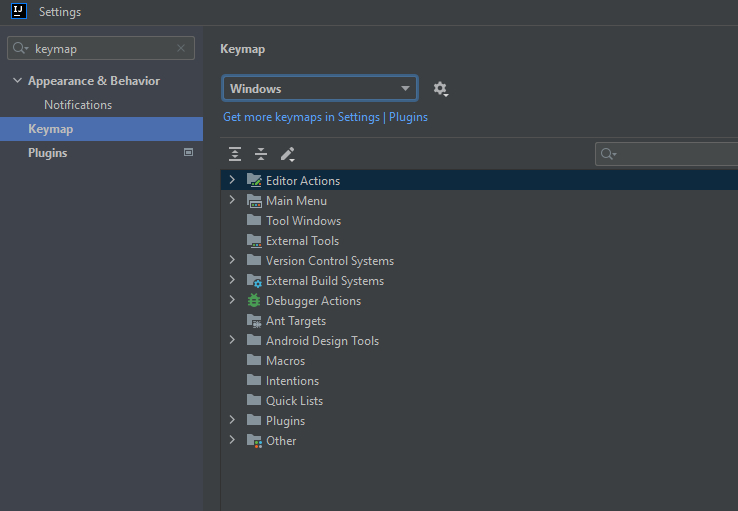
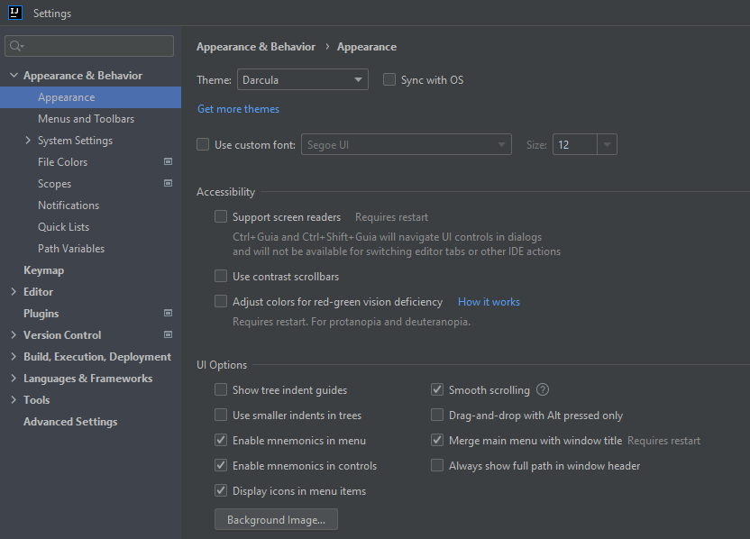
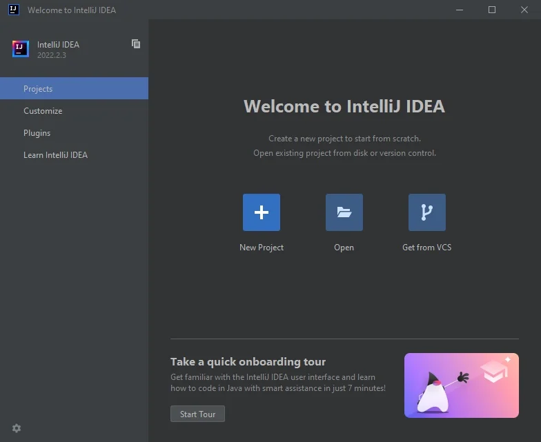
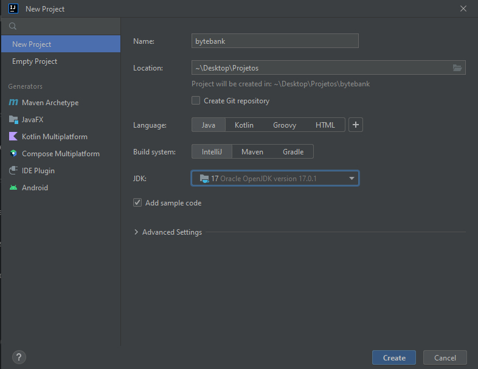
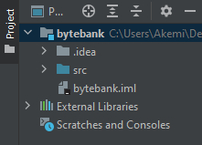
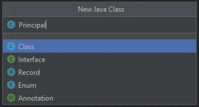

# IntelliJ IDEA: dicas e truques para usar no dia a dia


## Introdução

O IntelliJ é um ambiente de desenvolvimento integrado e com reconhecimento de contexto para trabalhar com Java e outras linguagens que rodam na **JVM**, como **Kotlin, Scala e Groovy**.

Um ponto importante a se pensar no momento da criação do código é a escolha da IDE. Por isso este artigo trará um **conjunto completo de informações sobre o Intellij IDEA**, vamos criar um novo projeto, navegar por ele, utilizar técnicas de refatoração e modo debug para analisar o código.

Veremos as facilidades que o IntelliJ nos fornece na hora de declarar variáveis, estrutura de controle de fluxo e até mesmo nas próprias estruturas de código.

Aprenderemos também algumas dicas e truques que podemos usar no IntelliJ IDEA no cotidiano como pessoas desenvolvedoras, aumentando a produtividade no trabalho em projetos Java.

## Configuração de atalhos: keymap

Um dos primeiros passos durante o uso do IntelliJ é a configuração do keymap, o mapa de atalhos que podemos utilizar durante o desenvolvimento com a IDE. O principal motivo para isso é conhecermos esses atalhos disponíveis, já que eles podem nos poupar tempo de trabalho.

A maneira tradicional de acessar o keymap é por meio do menu **File > Settings**..., então, filtramos por "keymap":



## Keymap References

Além de verificar os atalhos por meio da opção "Settings", também podemos acessar o PDF que contém todos os atalhos de todos os sistemas operacionais selecionando "Help > Keymap Reference". Fique à vontade para consultar os atalhos da maneira que achar mais confortável.

## Keymaps padrão entre os sistemas operacionais

No geral temos os seguintes valores padrão, considerando os diferentes sistemas operacionais:

- Windows: Default
- Linux: Default for XWin
- Mac: Mac OS X 10.5+

Por padrão, quando apresentarmos os atalhos, vamos escrever primeiro como eles poderiam ser usados no Windows e depois, com uma barra, como podem ser usados no Linux ou Mac.

```
Windows e Linux / Mac
```

## Modificando o tema

Uma configuração realizada por muitas pessoas antes de começar a escrever códigos é a personalização da aparência do IntelliJ. Para isso, selecione "**File > Settings" e filtre por "Appearance"**:



Nessa janela, você pode fazer as alterações que achar mais adequadas para seu uso. No meu dia a dia, costumo manter o valor do "Theme" como **Darcula**.

### Primeiros passos com a IDE: conhecendo os atalhos

Como estamos iniciando nosso desenvolvimento com a ferramenta, vamos selecionar a opção “New Project”:



Assim uma nova janela será aberta, na qual podemos configurar o projeto. Vamos selecionar a opção "Java" nas opções de projeto.

Durante o artigo trabalharemos em um projeto de um banco digital, então vamos nomeá-lo no campo "Project name" como "**bytebank**". Em “Project location” fica o caminho onde se encontra nosso projeto.

Em “Project SDK” deixamos a versão que está. Caso esta opção não apareça em seu projeto, basta clicar em "New" e selecionar o diretório de instalação do seu JDK.

Após essa configuração, basta clicar em "Create".



Conforme tudo carregar, teremos uma view chamada "Project" e poderemos visualizar toda a estrutura das pastas do projeto.

O primeiro diretório é o nosso, nomeado `bytebank`. Dentro dele há outro, o diretório `.idea` onde ficam todas as configurações do IntelliJ. Também temos a pasta `src` (source) onde colocaremos todas as nossas classes Java.



Para criar uma classe, bastaria clicarmos com o botão direito do mouse na pasta src e selecionar a opção "New" e em seguida "Java Class". Porém a grande vantagem da IDE é poder fazer os mesmos passos com atalhos. Vamos começar?

### Acessando a view de project

Para manipular a view do projeto, podemos usar o atalho **Alt + 1**, já que dessa forma é possível ocultar ou mostrar a view. Após a visualização, uma boa opção é navegar pelos diretórios com as setas do teclado.

Selecionando a pasta `src` com os atalhos, podemos clicar **Alt + insert** para criar algum arquivo.Nesta pasta, o IntelliJ vai mostrar as opções de arquivos que faz sentido estarem nesse diretório.

Selecionando a opção "Java Class", colocaremos o nome da classe de "Principal".



Mas como faremos para executar a classe? Sabemos que para executar, precisamos de um método `main()`. Poderíamos escrever toda a assinatura do método, porém a IDE também consegue nos auxiliar, bastando escrever diretamente dentro de um arquivo. No caso, dentro da classe `Principal` escreva ”**psvm**” e aperte a tecla Tab para que a assinatura seja escrita automaticamente:

```
public class Principal {

   public static void main(String[] args) {

   }
}
```

Após implementar o método `main()`, utilize o template `sout` dentro do corpo dele para implementar o método de impressão `System.out.println()`. A descrição para esse template é `Prints a string` `to System.out`. Após implementá-lo, adicione a mensagem "Bem vindo ao Bytebank".

```
public class Principal {

   public static void main(String[] args) {
       System.out.println("Bem vindo ao bytebank");
   }
}
```

Agora que temos a classe com o método `main()` pronta, vamos executá-la. Dentro da classe `Principal`, utilize o atalho **Alt + Shift + F10 / Ctrl + Shift + F10** Dessa forma, o IntelliJ vai interpretar que queremos executar a nossa classe atual.

Note que a princípio ele vai listar algumas opções de execução, portanto, escolha a classe `Principal`. O intelliJ executará e vai imprimir: “Bem vindo ao bytebank”. Você já deu seus primeiros passos com o intelliJ!

### Criando código com o generate

Inicialmente criamos a nossa classe `Principal` dentro do diretório raiz src. Porém, quando estamos desenvolvendo programas em Java, fazemos uso da convenção por pacotes que geralmente definem o domínio da nossa aplicação.

Sendo assim, vamos criar o pacote no nosso projeto para que a nossa classe Principal como também outras classes que iremos criar estejam organizadas.

### Criando pacotes

Para criar os pacotes, acesse a view project **Alt + 1 / CMD + 1** e navegue até o diretório src, em seguida, utilize o generate **Alt + Insert / CMD + N**. Com a opção de New visível, digite p... (ou package) e observe que aparecerá a opção Package. Tecle **Enter** e adicione o seguinte valor para o pacote “br.com.alura.bytebank”, por fim clique em **OK** ou tecle **Enter** novamente.


### [Menu - Java: Criando sua Primeira Aplicação](./menu.md)