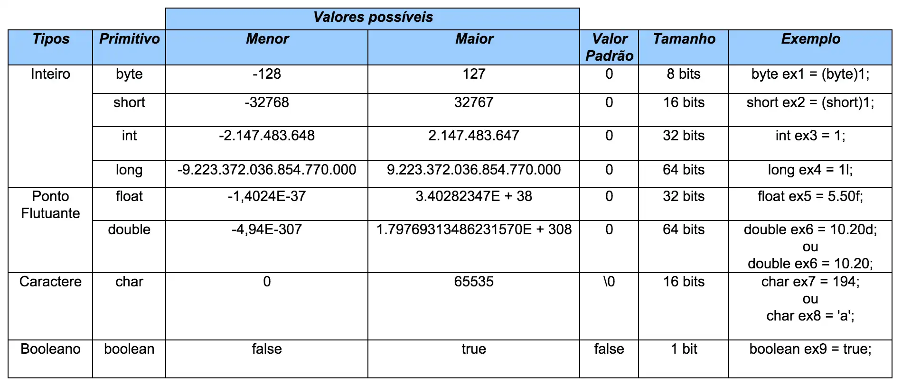

# Variáveis em Java

## O que são Variáveis?

Em Java, uma variável é como um recipiente que armazena um valor específico. Pense nela como uma caixa onde você guarda um objeto, um número ou uma palavra. Cada caixa (variável) tem um nome único para que você possa identificá-la e acessar o valor armazenado dentro dela.

## Declarando Variáveis

Para declarar uma variável em Java, você precisa especificar:

- **Tipo de dado**: O tipo de valor que a variável irá armazenar (por exemplo, inteiro, decimal, texto).
- **Nome**: Um identificador único para a variável.

### Sintaxe:

```
tipo_de_dado nome_da_variavel;
```

## Exemplo:


```
int idade; // Declara uma variável inteira chamada idade
double altura; // Declara uma variável de ponto flutuante chamada altura
String nome; // Declara uma variável do tipo String chamada nome
```

## Tipos de Dados Primitivos



Os tipos de dados primitivos são os mais básicos em Java e representam valores simples. Os principais são:

- **int**: Números inteiros (ex: 10, -5).
- **double**: Números de ponto flutuante (ex: 3.14, -0.5).
- **char**: Um único caractere (ex: 'a', 'Z').
- **boolean**: Valores lógicos (true ou false).
- **byte**: Números inteiros pequenos.
- **short**: Números inteiros menores que int.
- **long**: Números inteiros grandes.
- **float**: Números de ponto flutuante de precisão simples.

## Variáveis de Referência

Ao contrário dos tipos primitivos, as variáveis de referência não armazenam o valor diretamente, mas sim uma referência a um objeto. Ou seja, elas apontam para um local na memória onde o objeto está armazenado.

### Exemplo:

```
String mensagem = "Olá, mundo!";
```

Nesse exemplo, a variável `mensagem` não armazena a string "Olá, mundo!" diretamente, mas sim uma referência ao objeto String que contém essa string.

## A Classe String

A classe `String` representa sequências de caracteres. Ela é muito utilizada para manipular textos em Java. As strings são imutáveis, ou seja, depois de criadas, seu conteúdo não pode ser alterado.

### Operações com Strings:

- **Concatenar**: Juntar duas ou mais strings usando o operador `+`.
- **Comparações**: Comparar strings usando o método `equals()`.
- **Extrair substrings**: Obter partes de uma string usando os métodos s`ubstring()`.

### Exemplo:

```
String nome = "João";
String saudacao = "Olá, " + nome + "!";
System.out.println(saudacao); // Imprime: Olá, João!
```

## Inicializando Variáveis

É recomendado inicializar uma variável com um valor logo após sua declaração. Isso evita erros de compilação e torna o código mais seguro.

### Exemplo:

```
int idade = 25;
String nome = "Maria";
```

## Escopo de Variáveis

O escopo de uma variável define onde ela pode ser acessada dentro do seu programa. As variáveis declaradas dentro de um bloco (entre chaves) só podem ser acessadas dentro daquele bloco.

### Exemplo:

```
{
    int x = 10; // Variável x só existe dentro deste bloco
    System.out.println(x);
}
// Aqui não podemos acessar a variável x
```

### Dicas Adicionais

- **Nomes de variáveis**: Use nomes significativos que reflitam o propósito da variável.
- **Convenções de nomenclatura**: Siga as convenções de nomenclatura do Java (camelCase para variáveis).
- **Tipos de dados**: Escolha o tipo de dado mais adequado para o valor que você vai armazenar.
- **Inicialização**: Inicialize suas variáveis sempre que possível.
- **Escopo**: Entenda o conceito de escopo para evitar erros de compilação.

### [Menu - Java: Criando sua Primeira Aplicação](./menu.md)