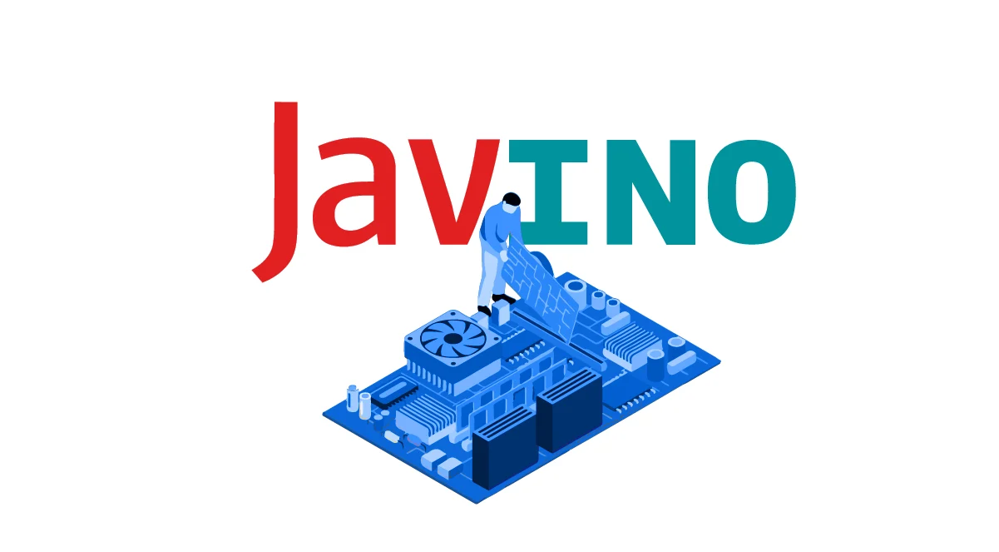

# Java: o que é, linguagem e um Guia para iniciar na tecnologia


## Introdução

O Java é uma das **plataformas** mais utilizadas para o **desenvolvimento de aplicações** ao redor do mundo. Além da plataforma, segundo dados da ***Pesquisa “Tecnologias mais populares de 2022”***, realizada pelo StackOverflow, a linguagem Java figura como a 6ª mais utilizada por pessoas desenvolvedoras, correspondendo a 33% do total pesquisado.


Créditos: “2022 Most popular technologies”, StackOverflow

Quem está iniciando com essa tecnologia pode encontrar alguma dificuldade para compreender a “quantidade de código” que é necessária para escrever uma mensagem como o famoso “Olá, mundo!”. Mas, não criemos pânico! O Java não é um bicho de 7 cabeças e com este artigo vamos lhe mostrar isso!


## O que é Java?

O Java, como **plataforma de programação**, nasceu no ano de 1995 dentro dos laboratórios da empresa Sun Microsystem como resultado de uma extensa pesquisa científica e tecnológica. A plataforma Java entrega um **ambiente completo** para o ***desenvolvimento e execução de programas***, sendo composta por:

- Uma ***linguagem de programação de alto nível orientada a objetos***;
- Máquina Virtual (Java Virtual Machine ou JVM), que garante **independência de plataforma**, pois o código executa na máquina virtual e essa pode ser portada para outras plataformas como Windows ou Linux;
- Java Runtime Environment ou **JRE**, que agrega a máquina virtual e alguns recursos para a execução de aplicações Java; e
- Java Development Kit ou **JDK**, que é um conjunto de utilitários que oferece suporte ao desenvolvimento de aplicações.

No Java, os programas são escritos em um arquivo com a extensão `.java`, que em um processo posterior serão compilados para arquivos com a extensão `.class`. Esses, por sua vez, contêm os códigos a serem executados na máquina virtual, os bytecodes.


A **JVM** está **disponível para a maioria dos sistemas operacionais** do mercado, sendo assim conseguimos rodar a mesma aplicação Java no Windows, macOS, Linux, Solaris, entre outros. Essa funcionalidade implementa um dos conceitos que nasceram forte com o Java:

- ***“escreva uma vez e execute em qualquer lugar!”***

- ### [O que é o Java? - vídeo](https://www.youtube.com/watch?v=90NcVNsKGik&t=623s)

## Um pouco de História

No longínquo ano de 1991, iniciou-se o desenvolvimento do que viria a se tornar a plataforma Java como uma parte do programa Green, que agrupava projetos que tinham como objetivo estabelecer a **nova geração de softwares inteligentes** para dispositivos eletrônicos, como televisores, videocassetes, torradeiras e demais utensílios, para que esses pudessem se comunicar com outros do mesmo tipo e também com computadores.

Para alcançar esse objetivo, foi decidida a criação de uma plataforma que fosse **portável** entre **diferentes tipos de equipamentos**. A linguagem a ser adotada foi o C + + devido a experiência dos desenvolvedores do projeto, porém, observou-se que essa linguagem não permitia realizar de maneira fácil tudo o que eles esperavam.

Neste momento, um dos líderes do projeto, James Gosling, propôs **criar uma nova linguagem** que pudesse atender aos requisitos esperados para o projeto e que fosse o mais simples possível. Assim, surge a linguagem Oak (em tradução livre, “Carvalho”), por ser um tipo de árvore que nascia nos arredores do escritório de Gosling. Junto à nova linguagem foi desenvolvido o sistema Green OS.

Nos idos de 1993, a equipe da Sun Microsystem finalizou um **protótipo** de dispositivo que ficou conhecido como Star 7, ou simplesmente 7, um PDA (Personal Digital Assistant) que utilizava a nova linguagem. Então, surge a oportunidade de participação de uma concorrência pública para a criação de tecnologia interativa que fosse compatível para TV a cabo, que foi vencida pela Silicon Graphics.

OK, mas e o Java? Por problemas com copyright, no ano de 1994, foi necessário **trocar o nome** de ***Oak*** para o seu nome definitivo: ***Java***. Impulsionados pelo crescimento da internet, os desenvolvedores Patrick Naughton e Jonathan Payne criaram o WebRunner, um programa para o navegador com a capacidade de download e execução de código Java.

Em 1995, no evento conhecido como SunWorl’95, a Sun apresenta ao mundo o navegador HotJava e a linguagem Java, que empolgou a comunidade de tecnologia da época. No ano seguinte, a gigante NetScape Corp lança a versão 2 do seu famoso navegador, o Navigator, que incorpora a funcionalidade de executar aplicações Java conhecidas como applets.

Com a chegada do ano de 1996, a Sun, em uma ação até então inédita, liberou de forma gratuita para a comunidade de software um conjunto de **ferramentas para desenvolvimento** usando a **linguagem Java**. Esse conjunto foi o conhecido JDK 1.02, que tinha como foco a plataforma Sun Solaris e o Windows 95/NT.

Um detalhe importante: a Sun liberou o Java e as ferramentas, mas continuou detentora dos direitos até 2009, quando a empresa foi comprada pela Oracle que continuou com a evolução da linguagem e da plataforma. Mas a aquisição da Sun não gerou impacto para os desenvolvedores Java, pois **a linguagem continua gratuita** e opera sob a licença GNU.

Abaixo você pode conferir uma **linha do tempo** com as **versões** e as **novidades implementadas** no Java no decorrer dos anos desde o seu lançamento:


Vale a pena destacar também que o Java, em sua **evolução**, parou de nomear as versões a partir do Java 8, e seu **versionamento atualizado é liberado de 6 em 6 meses**, adotando as formas Preview e LTS (Long Time Support).

## Tecnologia Java

A plataforma Java é estruturada em um portfólio de produtos para desenvolvimento e execução de aplicações, idealizando que um mesmo **programa** possa **funcionar em diferentes sistemas operacionais e dispositivos**. Atualmente a plataforma está dividida em duas grandes áreas:

- ***Java Standard Edition ou JavaSE***
- ***Java Enterprise Edition ou JavaEE***

## Java Standard Edition ou JavaSE

Componente padrão do Java que fornece um **ambiente** para o **desenvolvimento de aplicações de pequeno e médio porte**, além de um conjunto de APIs base da plataforma e a JVM padrão.

## Java Enterprise Edition ou JavaEE

Componente baseado no JavaSE, é **focado no desenvolvimento de aplicações empresariais multicamadas de grande porte** e provê serviços adicionais, ferramentas e APIs para simplificar a criação de aplicações complexas.

## O Java é gratuito?

Desde o seu lançamento oficial em 1996 até as suas mais recentes versões, o Java sofreu **evoluções e melhorias** que o permitiram se manter como uma plataforma e linguagem competitiva, o que explica sua grande popularidade.

Mas uma dúvida muito comum, principalmente para quem está iniciando, é a seguinte: o Java é gratuito? Uma pergunta pertinente, uma vez que a gigante de tecnologia Oracle comprou a Sun e a plataforma Java.

A resposta para essa pergunta encontramos no site da Oracle. O **Java é gratuito para estudo e testes**, porém, **para uso comercial e suporte você deverá desembolsar um valor para licenciamentos**. Mas, e agora?

## Kit de Ferramentas Java: OpenJDK

Hoje existe também uma versão totalmente gratuita do Java e de suas ferramentas que é mantida pela comunidade, contando também com o apoio da Oracle. Trata-se do OpenJDK, que é o **kit de ferramentas** para o desenvolvimento Java. Ele existe desde 2006, porém, desde a compra do Java pela Oracle, o kit passou a ganhar ainda mais força.

## Qual a diferença entre o Java Oracle e o OpenJDK?

Mas, então, existe diferença? O Java Oracle é desenvolvido com base no código oficial do projeto Open e permite uso completo e comercial, sendo **diferenciado pelo suporte e a forma de licenciamento**, mas tecnicamente ambas as versões são o mesmo Java.

## Como utilizar a Plataforma Java

O Java como **plataforma de computação** é muito utilizado, pois existe um grande número de aplicações para computador, sites e aplicativos que dependem do Java para funcionar. Por isso, é muito comum a pergunta: “Eu preciso do Java no meu computador?”.

Para executar as **aplicações Java** no nosso computador é necessária a **instalação** do ambiente de execução do Java ou JRE. Ela é uma camada de aplicação e é instalada no sistema operacional, **fornecendo a biblioteca de classes** e os **recursos necessários** para a execução do código Java pela JVM.

Como exemplo de aplicações que precisam do Java para funcionar, temos o aplicativo do Imposto de Renda de Pessoa Física (IRPF), utilizado pelo Ministério da Fazenda do Brasil. Aliás, muitos aplicativos oficiais do governo brasileiro foram desenvolvidos com o Java, como os utilizados para a Declaração do Imposto de Renda Retido na Fonte (DIRF) e a Relação Anual de Informações Sociais (GDRAIS).

Para **configurar o Java** em seu computador, executar aplicativos e componentes criados em Java, você pode **baixar a JRE** na página oficial da plataforma e efetuar a instalação para o sistema operacional de sua escolha.

- ### Visualização da instalação no Windows:


- ### Visualização da instalação no Mac OS X:


- Neste processo de instalação e configuração do Java em seu computador, você pode optar também pela instalação da versão Open:


## A Linguagem Java

O Java, como **linguagem de programação**, possui algumas características que o destacam das demais linguagens e lhe conferem a **popularidade** que tem hoje. Vamos elencar abaixo as principais:

### Independência de plataforma

Os programas escritos em Java não são compilados para uma plataforma específica como Windows, Linux ou Mac; eles são transformados para uma **linguagem intermediária**, chamada de `bytecodes`, que é interpretada para uma **máquina virtual**, e essa sim possui uma versão para os principais sistemas operacionais de mercado.

### Orientação a Objetos

O Java é uma linguagem orientada a objetos, que é uma forma de programar que possibilita trabalharmos **abstração**, **encapsulamento de código** e **herança**, o que lhe confere também uma **curva de aprendizagem bem suave**.

### Não usa ponteiros

Diferentemente de algumas linguagens de programação, o Java torna transparente o **uso de ponteiros**, pois **não** permite o **acesso direto à memória do computador** e o programador não precisa se preocupar em gerenciar os objetos na memória. A plataforma Java traz o coletor de lixo, que se encarrega de **limpar a memória** de objetos não referenciados.

### Multithread

A plataforma permite a **execução concorrente** de várias rotinas de uma aplicação, o que possibilita a construção de aplicações Java **robustas** e **modernas**.

### Performance

Desde o início, o Java foi pensado com foco em ser **compacto**, independente de plataforma e para funcionar em rede. Na utilização da JVM, durante a evolução da plataforma, foi incorporado o JIT (Just In Time), que converte os `bytecodes` em código nativo, o que trouxe ainda mais **performance em sua utilização**.

### Segurança

Pensando na implementação de **aplicações em redes**, o Java entrega uma boa solução para **segurança** das aplicações nele desenvolvidas. Há possibilidade de se especificar o nível de segurança ou determinar que aplicativos como applets sejam seguros ou não.

Além dessas características, a linguagem Java é bastante robusta e permite o trabalho com **tipos numéricos**, como inteiro ou ponto flutuante, de acordo com padrões internacionais, além de implementar e incentivar o controle de erros pela aplicação. A **Sintaxe da linguagem** também é bem simples, o que explica em parte como ela se tornou uma das linguagens orientadas a objetos mais populares do mundo.

- ### [Tire proveito dos recursos da Linguagem Java - vídeo](https://www.youtube.com/watch?v=QVMEMpiqAZY&t=1s)

## Sintaxe da Linguagem Java

Que tal conhecer um pouco mais sobre a linguagem Java? Para isso, vamos falar um pouco sobre a sua sintaxe.

Para criarmos um **programa**, podemos **dividir** o nosso **código fonte** em diversos arquivos com extensão .java, também conhecidos como unidades de compilação. Usando um editor de códigos, vamos definir o código fonte em Java (.java) para exibir uma mensagem em console, que será compilada em um .class para ser interpretada pela nossa JVM.

Abaixo temos um **exemplo de um código Java** para exibir uma mensagem:

```
class Hello {
    public static void main(String[] args) {
       System.out.println("Olá, Mundo! Sou o Java.");
    }
}
```

Uma aplicação básica Java deve ter o método `main`, que serve ***como uma porta de entrada para a execução da aplicação***, e é a partir dela que será criado o processo a ser executado pelo processador.

Para **começar** a escrever o **código Java**, é necessário utilizar um **editor de texto** para salvar pos arquivos `.java` e o JDK para realizar a compilação com o utilitário `javac`.

Para o código que exemplificamos acima, utilizamos o **VS Code** na plataforma Windows. Você pode conferir mais informações sobre como utilizar o Java no VS Code no nosso super artigo Desenvolvendo aplicações Java com o VS Code.

Para gerar os `bytecodes`, navegamos pelo console até o diretório onde se encontra o arquivo com a extensão .java e executamos o comando abaixo:

```
javac Hello.java
```

Um fato importante do Java é que ela é uma linguagem case-sensitive, ou seja, ela faz uma **distinção** entre letras minúsculas e maiúsculas, como em `classe` e `Classe`. Ela também é uma linguagem definida como **fortemente tipada**, então, na utilização de variáveis e objetos, devemos fornecer um tipo para ele.

Por exemplo: queremos definir um espaço na memória que iremos nomear como “valor”, sendo que esse recebe 100, que é do tipo inteiro, então escreveremos da seguinte forma:

```
int valor = 100;
System.out.println(valor); // exibe a mensagem no terminal
```

Na linguagem Java, temos os tipos de dados primitivos (o mesmo que existe em outras linguagens), apresentados de forma sucinta na tabela abaixo, e os tipos complexos (classes), que são definidos por nós.

|**Categoria**|	**Tipo**|
|-----|------------|
|Inteiro|	byte, short, int, long|
|Real|	float, double|
|Caracter|	char|
|Lógica|	boolean|

Os **tipos complexos**, as chamadas classes, são aqueles tipos criados pela pessoa programadora para a resolução de algum problema e que irão **representar** alguma **ideia ou conceito do mundo real**, que são a base do **paradigma de programação orientada a objetos**.

Para se aprofundar sobre a sintaxe do Java e entender mais fundamentos da linguagem, recomendamos que você acesse:

- ### [Como desenvolver Boas Práticas de Programação? - vídeo](https://www.youtube.com/watch?v=GUanHEGlje4)

## Android & IoT

### Java e Android

O Java, desde a sua criação, oferece recursos e suporte para o **desenvolvimento** de **aplicativos móveis**. Ele já teve a plataforma JavaME (Java Micro Edition), que foi descontinuada no decorrer dos anos, mas atualmente ainda configura como a principal linguagem de desenvolvimento para o sistema operacional **Android**.

Então, se o seu objetivo é trabalhar com o desenvolvimento de aplicativos, o Java é uma ótima opção para estudos, fornecendo ferramentas para **escrita de código, depuração e teste**.

- ### [Flutter e Java no Serpro – Hipsters On The Road](https://www.hipsters.tech/flutter-e-java-no-serpro-hipsters-on-the-road-59/)

### Java e IoT

A área de **Internet das Coisas (IoT)**, na atualidade, é uma das mais estudadas e é alvo de várias gigantes da indústria de tecnologia. **O conceito de IoT é permitir a comunicação entre hardwares (coisas) e pessoas** em diversas plataformas (sistemas operacionais).

Nesse contexto, já existem maneiras de rodar aplicações Java em placas **arduino**, uma das principais plataformas para desenvolvimento de projetos eletrônicos com base em hardware e software. Além disso, o mais interessante é que todos os arquivos e design de projetos arduinos estão disponíveis de forma gratuita pela Creative Commons Attribution Share-Alike License.

Para que uma aplicação Java possa se comunicar com placas arduino, podemos recorrer à biblioteca Javino, que possui uma **biblioteca** para Java e outra para Arduino. Ela foi desenvolvida pelos professores Carlos Pantoja e Nilson Lazarin, do Cefet-RJ, com base na pesquisa A Robotic-agent Platform for Embedding Software Agents Using Raspberry Pi and Arduino Boards.



A utilização do Java em **projetos de IoT** casa muito bem com a proposta inicial da plataforma, que era **permitir que equipamentos diversos pudessem interagir** por meio de um **sistema operacional** e um **software aplicativo**.

## Java e Orientação a Objetos

A **Orientação a Objetos é um paradigma de programação**, mas, afinal, o que isso quer dizer? Um paradigma é um **modelo** ou **estilo de programação** que aplicamos na criação de um software.

Nesse modelo de programação, a ideia é **aproximar os conceitos e ideias do mundo real** - traduzindo, por exemplo, um carro, uma pessoa ou mesmo uma conta bancária para o mundo virtual - e fazer com que esses conceitos na forma de **objetos de software** consigam se comunicar e interagir para executar uma funcionalidade para um sistema.

Esse paradigma nasceu em 1960, na Noruega, com a proposta da criação de **sistemas mais confiáveis, flexíveis** e de **fácil manutenção**. Na década seguinte, em 1970, o matemático, biólogo e desenvolvedor Alan Kay criou a primeira linguagem de programação a implementar esse paradigma, o SmallTalk.

Apesar de ter nascido a tanto tempo, foi com o Java que esse modelo de programação ganhou popularidade e passou a ser adotado em **larga escala** pela "indústria” de softwares; e aqui existe uma retroalimentação, pois a popularidade do Java também está muito atrelada ao fato da linguagem adotar esse paradigma.

Dentre as principais **vantagens** da adoção da Orientação a Objetos, além de minimizar a curva de aprendizagem, também temos a capacidade de reutilização, que **otimiza a produção de uma solução de software**, possibilitando maior qualidade, redução de tempo e custo de manutenção de sistemas.

## Classes e Objetos

Na Orientação a Objetos, temos dois **conceitos essenciais**, que são:

- **Classes**;
- **Objetos**.

## Classes

No mundo real, podemos **identificar e classificar** diversos objetos que compartilham um conjunto de características em comum. Por exemplo, um livro é um conceito que pode **representar** vários **objetos com características compartilhadas**, como capa, autor, número de páginas, ISBN, entre outros; assim, diante de objetos que têm em comum esse conjunto de características, conseguimos classificá-los como livros, certo?

### O que é Classe na Orientação a Objetos?

Por definição, uma classe serve como um **modelo**, uma “planta”, um desenho por meio do qual objetos serão criados. No Java, podemos definir uma classe como mostrado na codificação abaixo:

```
public class Pessoa {
    public String nome;
    public String email;
    public String cpf;  
}
```

Em uma classe, além das **características (propriedades)** comuns aos objetos, temos também os **comportamentos** que aquele objeto pode executar. Veja um exemplo:

```
public class Pessoa {
    public String nome;
    public String email;
    public String cpf;

    public String exibirDados() {
        return "=== Dados da Pessoa ===" + "\n" +
                "Nome: " + this.nome + "\n" +
                "Email: " + this.email + "\n" +
                "CPF: " + this.cpf;
    }
}
```


### [Voltar ao Menu - Aprenda a programar em Java com Orientação a Objetos](./menu.md)