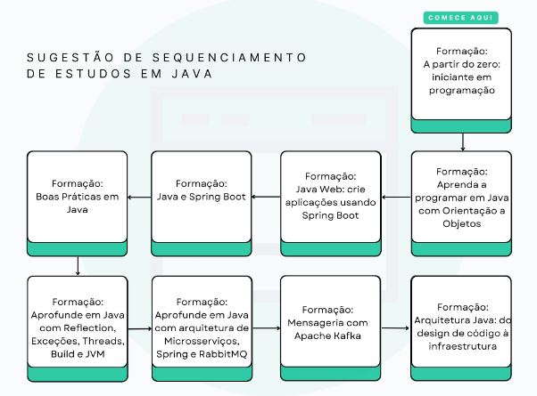

# Java: do zero ao avançado

<h2 align="center"> 🚀 Tecnologias</h2>

<h2 align="center"> 🗂️ Desafios e Projetos</h2>

- ### [Aprenda a programar em Java com Orientação a Objetos](JAVA-Orientacao-Objetos/menu.md)

